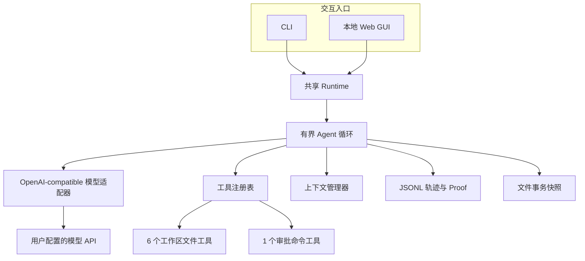
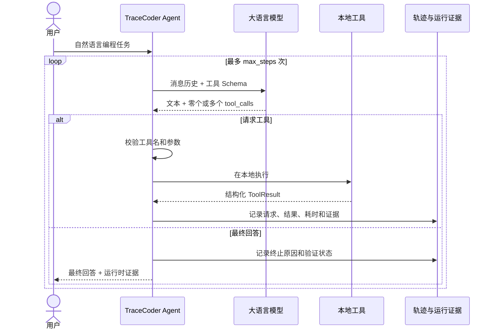

# TraceCoder

[](https://github.com/fanyuezuishuai/CodingAgent/actions/workflows/ci.yml)

TraceCoder 是一个从零实现的本地编程智能体（coding agent）。用户用自然语言提交编程任务后，它能够让大语言模型自主浏览项目、搜索和读取源码、修改文件、执行经过审批的命令、运行验证，并根据工具结果继续工作，直到完成任务或触发确定性终止条件。

项目没有使用 LangChain、LlamaIndex、OpenAI Agents SDK、Claude Agent SDK、AutoGen 等 Agent 框架，也不依赖 API 服务端托管的代码执行或文件工具。对话历史、上下文压缩、tool calling 解析、本地工具、执行循环、终止条件、错误处理、验证证据和轨迹记录均由项目自行实现。

- GitHub：https://github.com/fanyuezuishuai/CodingAgent
- Python：3.11+
- 模型接口：OpenAI-compatible Chat Completions tool calling
- 入口：CLI、本地 Web GUI、GitHub Codespaces

## 核心功能

| 功能 | 实现 |
|---|---|
| 自主 Agent 循环 | 模型回复、工具调用、工具结果回传和继续推理组成有界循环 |
| 七个本地工具 | 安全建目录、目录浏览、文本搜索、文件读取、文件写入、精确替换、命令执行 |
| 工具参数校验 | 自行实现 JSON Schema 子集校验；未知工具和错误参数以结构化结果返回 |
| 工作区文件安全 | 拒绝绝对路径、`..`、越界符号链接以及工作区根目录顶层的 `.env`、`.git`、`.tracecoder` |
| 命令审批 | CLI/Web 均在执行前展示真实 argv 和 cwd；Web 同时显示中文用途说明 |
| 确定性终止 | 支持正常完成、用户停止、最大步数、重复调用和提供方错误 |
| 验证状态 | 修改后要求执行 `purpose=verify` 的命令；后续修改会使旧验证失效 |
| 多轮上下文 | 同一 Web 对话持续携带 user/assistant/tool 消息；只有“新对话”会重置 |
| DeepSeek 思考模式 | 解析并原样回传可选 `reasoning_content`，支持跨工具步骤和跨用户轮次继续请求 |
| 上下文压缩 | 超预算时保留当前问题、运行时事实、最近轮次和完整 tool-call/result 包；不篡改模型协议状态 |
| 可追踪运行 | 每次运行写入按序、带时间、递归脱敏的 JSONL 事件轨迹 |
| Proof Mode | 从真实 Diff、命令退出码、验证状态和终止原因生成 JSON/Markdown 证据，不采信模型自述 |
| 事务式回滚 | 修改前保存文件快照，可接受或回滚文件工具产生的创建与覆盖操作 |
| 课程项目场景 | 同一个 Agent 提供“修复现有项目”和“生成小型带测试项目”两种任务预设 |
| 本地 Web GUI | 历史对话、Markdown 回答、折叠过程、文件上传、审批、停止和刷新恢复 |
| 自动化质量检查 | GitHub Actions 在 Windows/Linux、Python 3.11/3.13 上测试、检查并构建 wheel |

## 快速开始

### 1. 创建环境并安装

Windows PowerShell：

```powershell
git clone https://github.com/fanyuezuishuai/CodingAgent.git
cd CodingAgent
python -m venv .venv
.\.venv\Scripts\Activate.ps1
python -m pip install -e ".[dev]"
```

Linux/macOS：

```bash
git clone https://github.com/fanyuezuishuai/CodingAgent.git
cd CodingAgent
python3 -m venv .venv
source .venv/bin/activate
python -m pip install -e ".[dev]"
```

### 2. 配置模型

在准备让 Agent 操作的工作区根目录创建 `.env`：

```dotenv
TRACECODER_API_KEY=your-api-key
TRACECODER_BASE_URL=https://api.example.com/v1
TRACECODER_MODEL=your-tool-calling-model
```

TraceCoder 本仓库的 `.gitignore` 已忽略 `.env` 和 `.tracecoder/`，但这个保证不适用于任意目标工作区。如果 `--workspace` 指向另一个 Git 仓库，必须在那个仓库自己的 `.gitignore` 中加入 `.env` 和 `.tracecoder/`；如果 Web 上传文件也应只保留在本地，再加入 `uploads/`。路径生成后，请用 `git status` 或 `git check-ignore` 验证忽略规则确实生效。

CLI 与 Web 会自动读取 `--workspace` 目录下的 `.env`。配置先按同名键合并：进程环境变量覆盖 `.env` 中的同名键；合并完成后，每组别名优先选择 `TRACECODER_*`，再选择 `OPENAI_*`。因此 `.env` 中的 `TRACECODER_*` 值仍可能优先于进程中的对应 `OPENAI_*` 值。也兼容 `OPENAI_API_KEY`、`OPENAI_BASE_URL` 和 `OPENAI_MODEL`，但建议只使用一组命名，避免跨别名产生歧义。

DeepSeek 思考模式兼容性：OpenAI-compatible 适配器会读取可选的 `reasoning_content`，将它作为不透明协议状态保存在对应 assistant 消息中，并在同一工具循环及后续用户轮次完整回传。这样满足 DeepSeek [thinking mode 官方文档](https://api-docs.deepseek.com/guides/thinking_mode/)对多步工具调用的消息要求；不返回该字段的普通 OpenAI-compatible 提供方仍按原逻辑工作。压缩时可截短大段工具结果，但不会改写用户消息、assistant 的可见内容、思考状态或工具参数；若完整协议历史仍超预算，会明确返回协议错误而不是发送残缺历史。`reasoning_content` 不会进入 JSONL 轨迹、Web 事件或回答展示，用户看到的最终回复只来自 `content`。

不要把真实 API key 写进仓库、README、截图或演示视频；如果曾误提交，应立即作废并更换。

### 3. 启动 Web GUI

```powershell
.\.venv\Scripts\tracecoder.exe web --workspace .
```

浏览器打开：

```text
http://127.0.0.1:8765
```

保持终端窗口运行，按 `Ctrl+C` 停止服务。如果端口被占用：

```powershell
.\.venv\Scripts\tracecoder.exe web --workspace . --port 8766
```

`--workspace` 不是 Agent 程序的安装位置，而是 Agent 文件工具允许读写的根目录，也是命令默认工作目录。

虚拟环境激活后，也可以直接指定另一个项目：

```powershell
tracecoder web --workspace D:\path\to\project
```

### 4. 运行 CLI 任务

```powershell
.\.venv\Scripts\tracecoder.exe run "阅读项目，修复失败测试并验证" --workspace .
```

也可以使用课程项目预设：

```powershell
.\.venv\Scripts\tracecoder.exe run "修复计算器项目" --workspace . --scenario repair
.\.venv\Scripts\tracecoder.exe run "课题：计算器；目标目录：course_project" --workspace . --scenario generate
```

默认情况下，每条命令都需要用户批准。在 CLI 审批提示中按 `Ctrl+C` 会把当前命令视为拒绝，Agent 可以继续后续步骤；如果 `KeyboardInterrupt` 传播到 `Agent.run()`，本次运行会标记为 `interrupted`。只有明确了解风险时才使用自动批准：

```powershell
.\.venv\Scripts\tracecoder.exe run "运行测试并修复问题" --workspace . --yes
```

`--yes` 会允许模型请求的命令使用当前用户已有的主机权限，它不是沙箱模式。

### 5. 查看运行轨迹

CLI 和 Web 每次运行都会在工作区生成：

```text
.tracecoder/traces/<session-id>.jsonl
```

格式化查看：

```powershell
.\.venv\Scripts\tracecoder.exe trace .tracecoder\traces\<session-id>.jsonl
```

Proof Mode 还会生成：

```text
.tracecoder/proofs/<session-id>.json
.tracecoder/proofs/<session-id>.md
```

CLI 结束时会显示事务 ID。确认或回滚文件工具修改：

```powershell
tracecoder transaction accept <session-id> --workspace .
tracecoder transaction rollback <session-id> --workspace .
```

## 架构



一次典型任务的运行过程：



模型不直接拥有文件或进程权限。它只能提出结构化工具调用；本地 TraceCoder 负责校验、审批、执行、记录和终止。

## 核心代码

| 文件 | 职责 |
|---|---|
| `src/tracecoder/domain.py` | `ToolCall`、`ModelReply`、`ToolResult`、`RunResult` 和状态枚举 |
| `src/tracecoder/agent.py` | 模型—工具循环、重复检测、验证提醒、取消和终止 |
| `src/tracecoder/context.py` | 单轮/多轮消息的确定性预算压缩 |
| `src/tracecoder/runtime.py` | 为 CLI/Web 统一装配模型、工具、上下文和轨迹 |
| `src/tracecoder/config.py` | `.env`、系统环境变量、默认值与配置校验 |
| `src/tracecoder/identifiers.py` | 轨迹、Proof 与事务文件名使用的安全运行标识校验 |
| `src/tracecoder/trace.py` | 追加式 JSONL 轨迹、顺序锁和递归凭据脱敏 |
| `src/tracecoder/evidence.py` | 运行时 Proof 数据、Markdown/JSON 导出 |
| `src/tracecoder/transaction.py` | 文件工具修改前快照、接受与安全回滚 |
| `src/tracecoder/scenarios.py` | 课程项目修复与小型项目生成任务预设 |
| `src/tracecoder/llm/` | Provider-neutral 模型协议和 OpenAI-compatible 适配器 |
| `src/tracecoder/tools/` | 工具 Schema、参数验证、工作区文件操作和命令执行 |
| `src/tracecoder/cli.py` | `run`、`trace`、`transaction`、`web` 命令 |
| `src/tracecoder/web.py` | FastAPI、后台运行、会话历史、上传、审批和取消 |
| `src/tracecoder/web_static/` | 原生 HTML/CSS/JS GUI 与安全 Markdown 渲染 |

## Agent 循环与运行证据

`Agent.run()` 每一步都会：

1. 根据已知修改、验证状态和最近失败生成运行时事实；
2. 通过 `ContextManager` 把消息限制在字符预算内；
3. 把消息与七个工具的 JSON Schema 发送给模型；
4. 记录模型回复；
5. 校验并按顺序执行每个工具调用；
6. 将脱敏后的工具结果按 `tool_call_id` 放回消息历史；
7. 根据工具 metadata 更新修改文件和验证状态；
8. 继续请求模型，或返回确定性结束结果。

终止原因包括：

- `completed`：模型返回无工具调用的最终回复；
- `interrupted`：Web 用户请求停止，或 `KeyboardInterrupt` 到达 `Agent.run()`；CLI 审批提示中的 `Ctrl+C` 只会拒绝当前命令；
- `max_steps`：达到最大模型步数；
- `repeated_call`：连续重复相同工具和参数；
- `provider_error`：模型 API 或响应协议错误。

运行结束时，CLI/Web 展示的修改文件、统一 Diff、命令退出码、验证状态和终止原因来自本地运行时，而不是模型自述。Proof 不包含 `reasoning_content`。

Web 停止采用协作式取消：待审批命令会立即解除，但正在进行的模型请求或工具调用返回后，Agent 才能结束。

## 内置工具

| 工具 | 示例用途 |
|---|---|
| `create_directory` | 在已有安全父目录下新建一个目录 |
| `list_files` | 查看目录结构 |
| `search_text` | 定位函数、类或错误文本 |
| `read_file` | 按行读取 UTF-8 文本 |
| `write_file` | 原子创建或覆盖文件 |
| `replace_text` | 仅在匹配数量符合预期时精确修改 |
| `run_command` | 执行编译、测试、格式化或其他批准命令 |

文件工具只接受工作区相对路径。保留路径规则只检查工作区根目录的顶层条目；例如 `service/.env` 不会被该规则阻止。写入使用同目录临时文件和 `os.replace` 完成原子替换；精确替换会核对实际匹配数量，防止一次模糊请求误改多个位置。

每次文件写入、精确替换或建目录之前，事务模块会先记录原始状态。回滚会恢复被覆盖文件、删除本轮创建文件，并只删除本轮创建且仍为空的目录。单个原文件快照上限为 1,000,000 字节；超过上限时本次修改会在写入前失败，避免产生无法回滚的文件工具修改。开始新的修改事务会自动接受上一个尚未处理的事务，因此只能回滚最新一轮待确认修改。

命令工具使用参数数组和 `shell=False`，不会隐式解释管道、重定向或 `&&`。确实需要 Shell 语法时，模型必须显式请求 `cmd /c` 或 `sh -lc`，用户能在审批界面看到完整参数。

## Web GUI

Web GUI 使用 FastAPI + 原生 HTML/CSS/JavaScript，不依赖前端框架或完整网页 IDE。

支持：

- 左侧最近 50 个会话及轮数；
- 同一会话持续多轮上下文；
- 明确的“新对话”按钮；
- 首次输入前的问候页；
- 最终回复安全渲染常用 Markdown；
- 模型中间文本、工具请求和工具结果默认折叠；
- 固定在底部的输入框；
- 多文件上传，单文件上限 10 MiB；
- 命令中文用途说明和可展开的完整 argv；
- 停止运行和待审批解除；
- 页面刷新后重新发现活动任务；
- Proof Mode 证据卡、Diff/命令详情和 Markdown 导出；
- 文件工具修改的“接受修改 / 回滚修改”；
- 课程项目修复与小型项目生成快捷场景；
- 丢失提交响应、历史切换和上传切换等异步竞态保护。

会话消息保存在当前 Web 服务进程内存中。历史过长时，模型请求会被 `ContextManager` 压缩；服务重启后历史会清空，这与“模型请求上下文压缩”是两个不同层面的概念。

## 配置项

| 环境变量 | 默认值 | 说明 |
|---|---:|---|
| `TRACECODER_API_KEY` | 无 | 必填；也兼容 `OPENAI_API_KEY` |
| `TRACECODER_BASE_URL` | `https://api.openai.com/v1` | OpenAI-compatible API 根地址 |
| `TRACECODER_MODEL` | 无 | 必填；支持原生 tool calling 的模型 |
| `TRACECODER_MAX_STEPS` | `20` | 单次运行最大模型步数 |
| `TRACECODER_REPEAT_LIMIT` | `3` | 连续重复工具调用终止阈值 |
| `TRACECODER_CONTEXT_MAX_CHARS` | `100000` | 请求消息字符预算 |
| `TRACECODER_COMMAND_TIMEOUT` | `60` | 默认命令超时秒数 |
| `TRACECODER_COMMAND_OUTPUT_BYTES` | `20000` | stdout/stderr 各自保留上限 |

所有数值配置必须为正整数。命令单次请求的 `timeout_sec` 还会被限制在 1～600 秒。

## 安全边界

TraceCoder 实现的是受控 Agent Harness，而不是完整操作系统隔离：

- 文件工具拒绝绝对路径、父目录穿越和解析到工作区外的符号链接；
- 工作区根目录顶层的 `.env`、`.git/`、`.tracecoder/` 对模型文件工具保留；这不是递归保留规则；
- 工具名与参数在执行前校验；
- 命令必须逐次批准，除非用户显式使用 `--yes`；
- 子进程使用最小环境变量集合，不继承 API key；
- 命令有超时和运行期输出上限；
- Web 默认只监听 `127.0.0.1`；
- 非回环绑定默认拒绝，必须显式确认前方有认证代理；
- 轨迹中的已配置 key 会被递归替换为 `[REDACTED]`。

仍需了解的残余风险：

- 批准后的命令拥有当前用户权限，可能访问工作区外资源；
- 超时只保证终止直接进程，不保证结束全部后代进程；
- 读取的源码、用户提示和工具结果会发送给配置的模型提供方；`service/.env` 等嵌套敏感文件不会被顶层保留规则阻止，被读取后同样可能发送给提供方；
- Web 没有内置账号系统，不应直接公开到互联网。

## GitHub Codespaces

仓库的 `.devcontainer/devcontainer.json` 会安装项目并转发 8765 端口。

创建 Codespace 前，在 GitHub Codespaces Secrets 中配置：

- `TRACECODER_API_KEY`
- `TRACECODER_BASE_URL`
- `TRACECODER_MODEL`

然后在 Codespace 终端运行：

```bash
tracecoder web --workspace . --host 0.0.0.0 --port 8765 --trust-proxy-auth
```

从 **Ports** 面板打开 `TraceCoder Web`，并确保端口保持 **Private**。`--trust-proxy-auth` 只是安全确认，不会自行提供认证；这里依赖 GitHub 身份验证保护私有转发端口。

代码编辑可以使用 Codespaces 自带的浏览器版 VS Code，TraceCoder 页面负责对话、工具过程和审批，不尝试实现完整网页 IDE。

## 开发与测试

```powershell
.\.venv\Scripts\python.exe -m pytest -q
.\.venv\Scripts\python.exe -m ruff check .
.\.venv\Scripts\python.exe -m mypy
node --check src\tracecoder\web_static\markdown.js
node --check src\tracecoder\web_static\app.js
node tests\markdown_smoke.cjs
node tests\web_ui_smoke.cjs
.\.venv\Scripts\python.exe -m build --wheel
```

测试使用预设回复的假模型，不需要真实 API key。覆盖范围包括：

- 完整读取—修改—验证—结束循环；
- 多工具调用 ID 配对；
- 多轮上下文、DeepSeek `reasoning_content` 回传和超预算压缩；
- 路径越界、保留目录和符号链接；
- 命令拒绝、无隐式 Shell、超时、输出限制和凭据隔离；
- 重复调用、最大步数、模型错误和协作取消；
- JSONL 脱敏与并发记录；
- Proof JSON/Markdown、文件 Diff、事务接受/回滚和异常目录保护；
- 课程项目修复、生成 5～10 个文件的小型项目并真实运行测试；
- Web 会话、上传、审批、停止、刷新恢复和会话淘汰；
- Markdown XSS 防护与真实前端脚本 DOM 流程。
- 禁止 Agent 框架、服务端托管执行/文件工具及 `README.txt` 字数上限的合规回归检查。

GitHub Actions 会在 Ubuntu/Windows 与 Python 3.11/3.13 组合中执行测试、Ruff、严格 mypy、JavaScript 检查和 wheel 静态资源校验。

## 项目结构

```text
.
├─ src/tracecoder/
│  ├─ agent.py
│  ├─ cli.py
│  ├─ config.py
│  ├─ context.py
│  ├─ domain.py
│  ├─ evidence.py
│  ├─ identifiers.py
│  ├─ runtime.py
│  ├─ scenarios.py
│  ├─ trace.py
│  ├─ transaction.py
│  ├─ llm/
│  ├─ tools/
│  └─ web_static/
├─ tests/
├─ .github/workflows/ci.yml
├─ .devcontainer/devcontainer.json
├─ pyproject.toml
├─ README.md
└─ README.txt
```

## 当前限制

- Web 历史只保存在当前进程内存中，重启后不会恢复；
- 同一工作区只允许一个活动任务；
- 模型和工具调用为同步执行，Web 停止采用协作式取消；
- 文件工具主要面向 UTF-8 文本，不是二进制文件编辑器；
- 事务回滚只保证 TraceCoder 文件工具产生的修改；`run_command` 可能产生任意副作用，Proof 会明确提示；
- 命令若在新建目录中留下未记录文件（例如缓存），回滚会在改动任何文件前拒绝部分清理并报告具体路径；
- 小型项目生成重点保证约 5～10 个文件的课程演示，默认偏向 Python 标准库与 `unittest`，不承诺大型或任意技术栈项目；
- 内置 Markdown 渲染器支持常用子集，不是完整 CommonMark；
- 没有完整网页 IDE、多智能体、插件市场或远程托管执行；
- 运行真实任务需要用户自行提供支持 tool calling 的模型 API。

这些限制刻意保持了个人项目的可解释性：评委可以从仓库中直接定位每一项关键 Agent 逻辑，而不需要追踪大型框架内部行为。
