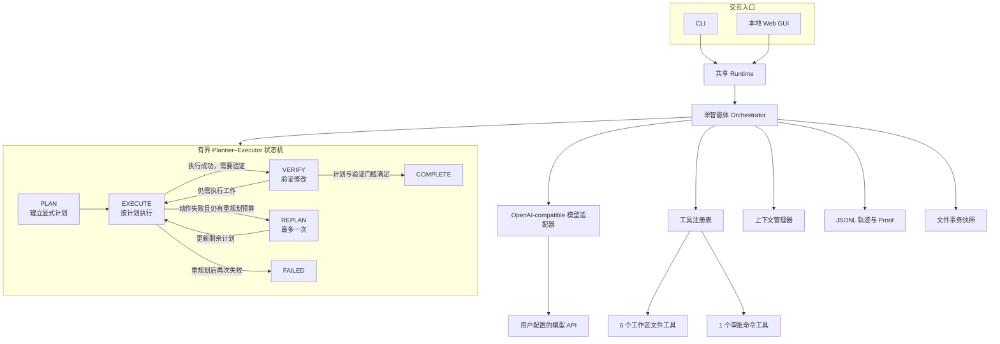
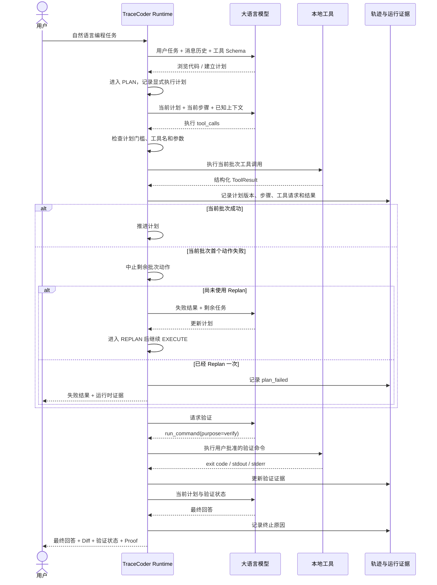

# TraceCoder

[](https://github.com/fanyuezuishuai/CodingAgent/actions/workflows/ci.yml)

TraceCoder 是一个从零实现的本地编程智能体（coding agent）。用户用自然语言提交编程任务后，它能够让大语言模型自主浏览项目、搜索和读取源码、建立显式执行计划、修改文件、执行经过审批的命令、在失败后进行有界重规划、运行验证，并根据运行时状态继续工作，直到完成任务或触发确定性终止条件。

核心 Agent 采用**单智能体、Planner–Executor 风格的有界编排架构**。外层运行时显式维护 `Plan -> Execute -> Replan -> Verify` 状态；执行阶段仍然使用模型原生 tool calling，根据工具结果继续决策。Planner、Executor 和 Verify 表示同一个 Agent 在不同阶段承担的职责，并不是多个独立运行的 Agent。

项目没有使用 LangChain、LlamaIndex、OpenAI Agents SDK 等 Agent 框架，也不依赖 API 服务端托管的代码执行或文件工具。对话历史、上下文压缩、tool calling 解析、显式计划、本地工具、执行编排、终止条件、错误处理、验证证据和轨迹记录均由项目自行实现。

* GitHub：https://github.com/fanyuezuishuai/CodingAgent
* Python：3.11+
* 模型接口：OpenAI-compatible Chat Completions tool calling
* 入口：CLI、本地 Web GUI、GitHub Codespaces

## 核心功能

| 功能                       | 实现                                                                          |
| ------------------------ | --------------------------------------------------------------------------- |
| 单智能体 Planner–Executor 编排 | 在原有模型—工具交互外增加显式 `Plan -> Execute -> Replan -> Verify` 状态控制                  |
| 显式执行计划                   | 文件修改和命令执行前必须先建立计划；运行时维护计划版本、当前步骤和执行进度                                       |
| 有界重规划                    | 执行失败后最多允许一次 Replan，避免无限修复和无界自我反思                                            |
| 批次 Fail-fast             | 同批工具动作中第一个动作失败后，剩余动作不再实际执行，避免基于失败前提继续修改                                     |
| 计划—执行关联                  | 执行结果关联对应的计划版本和计划步骤，使运行轨迹可以还原“为什么执行这一步”                                      |
| 独立验证门槛                   | 计划提醒和验证提醒相互独立；完成计划不等于通过验证，修改后的旧验证结果仍会失效                                     |
| 七个本地执行工具                 | 安全建目录、目录浏览、文本搜索、文件读取、文件写入、精确替换、命令执行                                         |
| 工具参数校验                   | 自行实现 JSON Schema 子集校验；未知工具和错误参数以结构化结果返回                                     |
| 工作区文件安全                  | 拒绝绝对路径、`..`、越界符号链接、Windows 路径别名/数据流，以及工作区根目录顶层的 `.env`、`.git`、`.tracecoder` |
| 命令审批                     | CLI/Web 均在执行前展示真实 argv 和 cwd；Web 同时显示中文用途说明                                 |
| 确定性终止                    | 支持正常完成、计划失败、用户停止、最大步数、重复调用和提供方错误                                            |
| 验证状态                     | 修改后要求执行 `purpose=verify` 的命令；明确标记为“模型选择的验证命令通过”，后续修改会使旧结果失效                 |
| 多轮上下文                    | 同一 Web 对话持续携带 user/assistant/tool 消息；只有“新对话”会重置                             |
| DeepSeek 思考模式            | 解析并原样回传可选 `reasoning_content`，支持跨工具步骤和跨用户轮次继续请求                             |
| 上下文压缩                    | 超预算时保留当前问题、运行时事实、计划状态、最近轮次和完整 tool-call/result 包；不篡改模型协议状态                  |
| 可追踪运行                    | 每次运行写入按序、带时间、递归脱敏的 JSONL 事件轨迹                                               |
| Proof Mode               | 从真实 Diff、命令退出码、验证状态和终止原因生成 JSON/Markdown 证据，不采信模型自述                         |
| 事务式回滚                    | 修改前保存文件快照，可接受或回滚文件工具产生的创建与覆盖操作                                              |
| 项目容器                     | 结构化新建项目，可上传现有代码或从零开始；项目内多对话共享上下文                                            |
| 本地 Web GUI               | 历史对话与项目归组、Markdown 回答、折叠过程、文件上传、审批、停止和刷新恢复                                  |
| 自动化质量检查                  | GitHub Actions 在 Windows/Linux、Python 3.11/3.13 上测试、检查并构建 wheel             |

## 快速开始

### 1. 创建环境并安装

Windows PowerShell：

```powershell
git clone https://github.com/fanyuezuishuai/CodingAgent.git
cd CodingAgent
python -m venv .venv
.\.venv\Scripts\Activate.ps1
python -m pip install -e ".[dev]"
```

Linux/macOS：

```bash
git clone https://github.com/fanyuezuishuai/CodingAgent.git
cd CodingAgent
python3 -m venv .venv
source .venv/bin/activate
python -m pip install -e ".[dev]"
```

### 2. 配置模型

在准备让 Agent 操作的工作区根目录创建 `.env`：

```dotenv
TRACECODER_API_KEY=your-api-key
TRACECODER_BASE_URL=https://api.example.com/v1
TRACECODER_MODEL=your-tool-calling-model
```

TraceCoder 本仓库的 `.gitignore` 已忽略 `.env` 和 `.tracecoder/`，但这个保证不适用于任意目标工作区。如果 `--workspace` 指向另一个 Git 仓库，必须在那个仓库自己的 `.gitignore` 中加入 `.env` 和 `.tracecoder/`；如果 Web 上传文件也应只保留在本地，再加入 `uploads/`。路径生成后，请用 `git status` 或 `git check-ignore` 验证忽略规则确实生效。

CLI 与 Web 会自动读取 `--workspace` 目录下的 `.env`。配置先按同名键合并：进程环境变量覆盖 `.env` 中的同名键；合并完成后，每组别名优先选择 `TRACECODER_*`，再选择 `OPENAI_*`。因此 `.env` 中的 `TRACECODER_*` 值仍可能优先于进程中的对应 `OPENAI_*` 值。也兼容 `OPENAI_API_KEY`、`OPENAI_BASE_URL` 和 `OPENAI_MODEL`，但建议只使用一组命名，避免跨别名产生歧义。

DeepSeek 思考模式兼容性：OpenAI-compatible 适配器会读取可选的 `reasoning_content`，将它作为不透明协议状态保存在对应 assistant 消息中，并在同一工具循环及后续用户轮次完整回传。这样满足 DeepSeek [thinking mode 官方文档](https://api-docs.deepseek.com/guides/thinking_mode/) 对多步工具调用的消息要求；不返回该字段的普通 OpenAI-compatible 提供方仍按原逻辑工作。

压缩时可截短大段工具结果，但不会改写用户消息、assistant 的可见内容、思考状态或工具参数；若完整协议历史仍超预算，会明确返回协议错误而不是发送残缺历史。`reasoning_content` 不会进入 JSONL 轨迹、Web 事件或回答展示，用户看到的最终回复只来自 `content`。

不要把真实 API key 写进仓库、README、截图或演示视频；如果曾误提交，应立即作废并更换。

### 3. 启动 Web GUI

```powershell
.\.venv\Scripts\tracecoder.exe web --workspace .
```

浏览器打开：

```text
http://127.0.0.1:8765
```

保持终端窗口运行，按 `Ctrl+C` 停止服务。如果端口被占用：

```powershell
.\.venv\Scripts\tracecoder.exe web --workspace . --port 8766
```

`--workspace` 不是 Agent 程序的安装位置，而是 Agent 文件工具允许读写的根目录，也是命令默认工作目录。

虚拟环境激活后，也可以直接指定另一个项目：

```powershell
tracecoder web --workspace D:\path\to\project
```

### 4. 运行 CLI 任务

```powershell
.\.venv\Scripts\tracecoder.exe run "阅读项目，修复失败测试并验证" --workspace .
```

也可以使用课程项目预设：

```powershell
.\.venv\Scripts\tracecoder.exe run "修复计算器项目" --workspace . --scenario repair
.\.venv\Scripts\tracecoder.exe run "课题：计算器；目标目录：course_project" --workspace . --scenario generate
```

默认情况下，每条命令都需要用户批准。在 CLI 审批提示中按 `Ctrl+C` 会把当前命令视为拒绝，Agent 可以继续后续步骤；如果 `KeyboardInterrupt` 传播到 `Agent.run()`，本次运行会标记为 `interrupted`。

只有明确了解风险时才使用自动批准：

```powershell
.\.venv\Scripts\tracecoder.exe run "运行测试并修复问题" --workspace . --yes
```

`--yes` 会允许模型请求的命令使用当前用户已有的主机权限，它不是沙箱模式。

### 5. 查看运行轨迹

CLI 和 Web 每次运行都会在工作区生成：

```text
.tracecoder/traces/<session-id>.jsonl
```

格式化查看：

```powershell
.\.venv\Scripts\tracecoder.exe trace .tracecoder\traces\<session-id>.jsonl
```

Proof Mode 还会生成：

```text
.tracecoder/proofs/<session-id>.json
.tracecoder/proofs/<session-id>.md
```

CLI 结束时会显示事务 ID。确认或回滚文件工具修改：

```powershell
tracecoder transaction accept <session-id> --workspace .
tracecoder transaction rollback <session-id> --workspace .
```

## 架构

TraceCoder 的核心不是多个独立 Agent，而是一个由本地 Runtime 约束的**单智能体 Planner–Executor 状态机**。

外层状态负责决定当前任务处于规划、执行、重规划还是验证阶段；状态内部仍然使用模型原生 tool calling 完成源码浏览、文件修改和命令执行。



Planner、Executor、Replan 和 Verify 并不是四个独立模型，也不是四个运行时 Agent。

它们是 `Agent.run()` 中由本地运行时维护的不同阶段：

```text
用户任务
   |
   v
 PLAN
   |
   v
EXECUTE
   |
   +------ action failure ------> REPLAN
   |                                |
   |                                |
   +<-------------------------------+
   |
   v
 VERIFY
   |
   v
COMPLETE
```

执行阶段内部仍然保持 tool-calling Agent 的交互方式：

```text
Model
  |
  v
Tool Call
  |
  v
Local Runtime
  |
  v
Tool Result
  |
  v
Model
```

因此 TraceCoder 更准确的定位是：

> **plan-driven single-agent coding agent with bounded tool execution**


### 一次典型任务的运行过程



模型不直接拥有文件或进程权限。它只能提出结构化工具调用；本地 TraceCoder 负责计划门槛、校验、审批、执行、状态推进、记录和确定性终止。

## 为什么从普通 Tool Loop 升级为 Planner–Executor

原来的核心执行模式可以概括为：

```text
Model
  -> Tool
  -> Observation
  -> Model
  -> Tool
  -> Observation
  -> ...
```

这种结构简单、调用开销低，也保留了 ReAct-style 的动态决策能力，但任务计划主要隐含在模型上下文中。

对于多步骤代码修改，运行时很难直接回答：

* 当前执行对应哪个任务步骤；
* 一个失败动作之后是否应该继续同批剩余动作；
* 模型是在继续原计划，还是已经改变方案；
* 为什么发生第二次尝试；
* 什么时候应该停止反复修复；
* 最终验证是否对应当前版本的代码。

Planner–Executor 升级把这些隐式决策中的一部分提升为运行时显式状态：

```text
Implicit reasoning
       |
       v
Explicit Plan
       |
       v
Bounded Execute
       |
       +---- failure ----> One Replan
       |
       v
Independent Verify
```

它并没有删除模型在执行阶段根据工具结果继续决策的能力，而是在外层增加计划、失败预算和验证约束。

主要变化包括：

1. 文件修改和命令执行前必须存在显式计划；
2. 执行结果与计划版本、计划步骤关联；
3. 当前批次第一个动作失败后，后续动作不再实际执行；
4. 执行失败最多触发一次 Replan；
5. Replan 后再次执行失败时可以确定性终止；
6. 计划完成与验证通过是两套独立条件；
7. 最终完成仍保留原有验证门槛；
8. 整个过程仍受 `max_steps` 等全局边界限制。

### 架构升级的开销约束

这次升级没有引入：

* 新 Agent 框架；
* 运行时多智能体；
* 独立 Planner 模型；
* 独立 Critic / Reflection 模型；
* 独立 Verifier LLM 调用；
* 新的模型适配层；
* 新的文件或命令执行实现；
* 新的 Proof 或事务系统。

在当前实现的正常执行路径中，模型请求数量仍保持为 **4 次**。

Planner–Executor 所需静态提示词和工具 Schema 相比原实现的增量约为 **15.0%**，低于设计目标中的 20%。

因此这次升级主要增加的是**运行时编排约束和可观测状态**，而不是增加新的模型角色或显著扩大正常路径的 LLM 调用开销。

## 核心代码

| 文件                              | 职责                                                                          |
| ------------------------------- | --------------------------------------------------------------------------- |
| `src/tracecoder/domain.py`      | `ToolCall`、`ModelReply`、`ToolResult`、`RunResult`，以及 Agent 阶段、验证状态、终止原因等状态枚举 |
| `src/tracecoder/agent.py`       | Planner–Executor 状态机、显式计划、计划步骤推进、单次 Replan、批次 Fail-fast、重复检测、验证提醒、取消和确定性终止  |
| `src/tracecoder/context.py`     | 单轮/多轮消息和运行时事实的确定性预算压缩                                                       |
| `src/tracecoder/runtime.py`     | 为 CLI/Web 统一装配模型、工具、上下文和轨迹                                                  |
| `src/tracecoder/config.py`      | `.env`、系统环境变量、默认值与配置校验                                                      |
| `src/tracecoder/identifiers.py` | 轨迹、Proof 与事务文件名使用的安全运行标识校验                                                  |
| `src/tracecoder/trace.py`       | 追加式 JSONL 轨迹、计划/步骤关联、顺序锁和递归凭据脱敏                                             |
| `src/tracecoder/evidence.py`    | 运行时 Proof 数据、Markdown/JSON 导出                                               |
| `src/tracecoder/transaction.py` | 文件工具修改前快照、接受与安全回滚                                                           |
| `src/tracecoder/scenarios.py`   | 课程项目修复与小型项目生成任务预设                                                           |
| `src/tracecoder/llm/`           | Provider-neutral 模型协议和 OpenAI-compatible 适配器                                |
| `src/tracecoder/tools/`         | 工具 Schema、参数验证、工作区文件操作和命令执行                                                 |
| `src/tracecoder/cli.py`         | `run`、`trace`、`transaction`、`web` 命令                                        |
| `src/tracecoder/web.py`         | FastAPI、后台运行、会话历史、上传、审批和取消                                                  |
| `src/tracecoder/web_static/`    | 原生 HTML/CSS/JS GUI 与安全 Markdown 渲染                                          |

## Agent 编排与运行证据

`Agent.run()` 仍然是一个受 `max_steps` 约束的模型—工具运行循环，但现在循环外同时维护显式 Planner–Executor 状态。

一次运行需要同时维护两类状态：

```text
任务编排状态
├─ 当前 phase
├─ 当前计划
├─ 计划版本
├─ 当前计划步骤
├─ 已完成步骤
└─ Replan 是否已经使用

执行与验证状态
├─ changed files
├─ recent failures
├─ verification status
└─ termination reason
```

### Plan

任务开始后，Agent 可以先通过只读信息理解项目。

但是在执行会改变工作区状态的操作之前，必须先建立显式计划。

其中包括：

* 文件创建；
* 文件写入；
* 精确替换；
* 目录创建；
* 命令执行。

计划至少使运行时能够确定：

* 当前任务准备完成哪些步骤；
* 当前正在执行哪个步骤；
* 工具调用属于哪个计划版本；
* 一个步骤完成后应该推进到哪里。

计划是运行时状态，而不仅是模型回复中的自然语言描述。

### Execute

进入 Execute 后，模型仍然通过原生 tool calling 选择具体操作。

本地运行时负责：

1. 检查当前是否存在有效计划；
2. 检查工具名和参数；
3. 进行路径和安全校验；
4. 对命令请求用户审批；
5. 按顺序执行工具调用；
6. 将结果关联到当前计划版本和步骤；
7. 根据结果更新修改、失败和验证状态；
8. 将结构化 ToolResult 放回模型消息历史。

因此：

```text
Plan 决定“当前准备完成什么”
Tool Call 决定“具体怎么做”
Runtime 决定“这个动作是否允许执行”
```

### 批次 Fail-fast

模型一次回复可以包含多个工具调用。

如果当前 action batch 的第一个失败动作已经使后续操作的前提不再可靠，TraceCoder 不会继续盲目执行剩余动作。

规则是：

```text
Action 1 -> success
Action 2 -> failure
Action 3 -> aborted
Action 4 -> aborted
```

后续动作不会实际执行。

这样可以避免例如：

```text
写入文件失败
   |
   v
仍然执行依赖该文件的测试
   |
   v
继续基于错误测试结果修改其他文件
```

产生级联错误。

### Replan

如果执行阶段出现失败，Agent 可以进入 `REPLAN`。

Replan 用于根据真实工具失败结果修改剩余执行方案，而不是无限重复原来的动作。

当前实现最多允许 **1 次 Replan**：

```text
Plan v1
   |
   v
Execute
   |
 failure
   |
   v
Replan
   |
   v
Plan v2
   |
   v
Execute
```

如果重规划后的执行再次失败，运行时不会继续进入无界的：

```text
Replan
 -> Execute
 -> Replan
 -> Execute
 -> Replan
 -> ...
```

而是可以通过计划失败终止原因结束当前运行。

因此 Replan 是一种**有界恢复机制**，不是独立 Reflection Agent。

### Verify

验证和计划是两套独立约束。

```text
计划完成 ≠ 验证通过
验证通过 ≠ 可以忽略尚未完成的计划
```

文件发生修改后，之前的成功验证结果仍然会失效。

模型需要请求：

```text
run_command(..., purpose=verify)
```

执行用户批准的验证命令。

只有当前代码状态对应的验证满足既有完成门槛后，Agent 才能正常结束修改任务。

`verify_command_passed` 仍然只表示：

> 模型选择且用户批准的验证命令返回了退出码 0。

它不表示 TraceCoder 已经形式化证明程序完全正确。

### 每一步模型交互

在新的 Planner–Executor 结构下，`Agent.run()` 的循环仍然会：

1. 根据计划、已知修改、验证状态和最近失败生成运行时事实；
2. 通过 `ContextManager` 把消息限制在字符预算内；
3. 把消息与工具 JSON Schema 发送给模型；
4. 记录模型回复；
5. 根据当前 phase 和计划状态检查动作是否允许；
6. 校验并按顺序执行允许的工具调用；
7. 在批次首个动作失败后阻止剩余动作继续执行；
8. 将脱敏后的工具结果按 `tool_call_id` 放回消息历史；
9. 将执行结果关联到对应计划版本和步骤；
10. 根据工具 metadata 更新修改文件和验证状态；
11. 在允许范围内执行一次 Replan；
12. 继续请求模型，或返回确定性结束结果。

### 终止原因

终止原因包括：

* `completed`：计划与原有验证完成门槛满足后正常结束；
* `plan_failed`：计划执行无法继续，且允许的重规划已经无法恢复；
* `interrupted`：Web 用户请求停止，或 `KeyboardInterrupt` 到达 `Agent.run()`；CLI 审批提示中的 `Ctrl+C` 只会拒绝当前命令；
* `max_steps`：达到最大模型步数；
* `repeated_call`：连续重复相同工具和参数；
* `provider_error`：模型 API 或响应协议错误。

运行结束时，CLI/Web 展示的修改文件、统一 Diff、命令退出码、验证状态和终止原因来自本地运行时，而不是模型的文字自述。

Proof 会保留真实 argv，并明确说明验证命令成功不等于验证充分。Proof 不包含 `reasoning_content`。

Web 停止采用协作式取消：待审批命令会立即解除，但正在进行的模型请求或工具调用返回后，Agent 才能结束。

## 内置工具

Planner–Executor 升级没有改变原有本地文件和命令工具的实现与权限边界。

七个实际操作工作区或本地进程的工具仍然是：

| 工具                 | 示例用途               |
| ------------------ | ------------------ |
| `create_directory` | 在已有安全父目录下新建一个目录    |
| `list_files`       | 查看目录结构             |
| `search_text`      | 定位函数、类或错误文本        |
| `read_file`        | 按行读取 UTF-8 文本      |
| `write_file`       | 原子创建或覆盖文件          |
| `replace_text`     | 仅在匹配数量符合预期时精确修改    |
| `run_command`      | 执行编译、测试、格式化或其他批准命令 |

显式计划属于 Agent 编排层。

它负责约束：

```text
什么时候允许修改
什么时候允许执行命令
当前操作属于哪个计划步骤
失败后是否允许 Replan
什么时候进入 Verify
```

它不会绕过下列本地工具已有的路径、安全、审批或事务约束。

文件工具只接受工作区相对路径。保留路径规则只检查工作区根目录的顶层条目；例如 `service/.env` 不会被该规则阻止。

写入使用同目录临时文件和 `os.replace` 完成原子替换；精确替换会核对实际匹配数量，防止一次模糊请求误改多个位置。

每次文件写入、精确替换或建目录之前，事务模块会先记录原始状态。回滚会恢复被覆盖文件、删除本轮创建文件，并只删除本轮创建且仍为空的目录。

单个原文件快照上限为 1,000,000 字节；超过上限时本次修改会在写入前失败，避免产生无法回滚的文件工具修改。

开始新的修改事务会自动接受上一个尚未处理的事务，因此只能回滚最新一轮待确认修改。

命令工具使用参数数组和 `shell=False`，不会隐式解释管道、重定向或 `&&`。

确实需要 Shell 语法时，模型必须显式请求 `cmd /c` 或 `sh -lc`，用户能在审批界面看到完整参数。

## Web GUI

Web GUI 使用 FastAPI + 原生 HTML/CSS/JavaScript，不依赖前端框架或完整网页 IDE。

支持：

* 左侧最近 50 个会话及轮数；
* 同一会话持续多轮上下文；
* 明确的“新对话”按钮；
* 首次输入前的问候页；
* 最终回复安全渲染常用 Markdown；
* 模型中间文本、工具请求和工具结果默认折叠；
* 固定在底部的输入框；
* 多文件上传，单文件上限 10 MiB；
* 命令中文用途说明和可展开的完整 argv；
* 停止运行和待审批解除；
* 页面刷新后重新发现活动任务；
* Proof Mode 证据卡、左右分栏红删绿增 Diff 和 Markdown 导出；GUI 隐藏命令证据，导出仍保留完整本地证据；
* 文件工具修改的“接受修改 / 回滚修改”；
* 类 GPT 项目页：结构化项目表单、可选代码上传、项目对话归组与历史标签；创建后会自动开启对话，先生成落地方案并等待用户批准，再进入编码阶段；服务端项目状态机会在规划完成前拒绝完整工具，规划回合也只暴露并执行只读工具；
* 项目内每个对话都是独立的 UI 会话，但共用同一份模型消息上下文，可在现有代码修改和从零开发之间自然切换；
* 丢失提交响应、历史切换和上传切换等异步竞态保护。

需要区分两种不同层级的“规划”：

```text
Web 项目创建流程
    |
    | 生成项目落地方案
    | 用户批准
    v
Agent.run()
    |
    | Runtime Planner–Executor
    v
PLAN -> EXECUTE -> REPLAN -> VERIFY
```

Web 项目创建阶段的“先生成落地方案并等待用户批准”属于**项目级交互流程**。

`Agent.run()` 内部的 Planner–Executor 则属于**单次 Agent 运行时的执行编排机制**。

两者作用层级不同，并不是两个独立 Planner Agent。

普通会话和项目消息保存在当前 Web 服务进程内存中。普通会话之间隔离；项目内的多个对话共用该项目的消息历史，上传文件也会自动带入后续项目任务。

历史过长时，模型请求会被 `ContextManager` 压缩；服务重启后这些内存历史和项目都会清空。

## 配置项

| 环境变量                              |                         默认值 | 说明                        |
| --------------------------------- | --------------------------: | ------------------------- |
| `TRACECODER_API_KEY`              |                           无 | 必填；也兼容 `OPENAI_API_KEY`   |
| `TRACECODER_BASE_URL`             | `https://api.openai.com/v1` | OpenAI-compatible API 根地址 |
| `TRACECODER_MODEL`                |                           无 | 必填；支持原生 tool calling 的模型  |
| `TRACECODER_MAX_STEPS`            |                        `20` | 单次运行最大模型步数                |
| `TRACECODER_REPEAT_LIMIT`         |                         `3` | 连续重复工具调用终止阈值              |
| `TRACECODER_CONTEXT_MAX_CHARS`    |                    `100000` | 请求消息字符预算                  |
| `TRACECODER_COMMAND_TIMEOUT`      |                        `60` | 默认命令超时秒数                  |
| `TRACECODER_COMMAND_OUTPUT_BYTES` |                     `20000` | stdout/stderr 各自保留上限      |

所有数值配置必须为正整数。

命令单次请求的 `timeout_sec` 还会被限制在 1～600 秒。

Planner–Executor 当前没有增加单独的用户配置项；一次 Replan 的上限属于核心运行时编排约束。

## 安全边界

TraceCoder 实现的是受控 Agent Harness，而不是完整操作系统隔离：

* 文件工具拒绝绝对路径、父目录穿越、解析到工作区外的符号链接，以及 NTFS 数据流、尾随点/空格和 Windows 设备名；
* 工作区根目录顶层的 `.env`、`.git/`、`.tracecoder/` 对模型文件工具保留；这不是递归保留规则；
* 工具名与参数在执行前校验；
* 文件修改和命令执行现在还需要满足运行时计划门槛；
* 命令必须逐次批准，除非用户显式使用 `--yes`；
* 子进程使用最小环境变量集合，不继承 API key；
* 命令有超时和运行期输出上限；超时会在 Windows/POSIX 上尽力终止整个进程树；
* Web 默认只监听 `127.0.0.1`；
* 非回环绑定默认拒绝，必须显式确认前方有认证代理；
* 轨迹中的已配置 key 会被递归替换为 `[REDACTED]`。

Planner–Executor 提供的是**Agent 行为约束**，不是新的操作系统安全边界。

显式计划可以减少模型在没有执行方案时直接修改文件或运行命令，但它不能替代：

* 文件路径隔离；
* 用户命令审批；
* 进程权限控制；
* 操作系统沙箱。

仍需了解的残余风险：

* 批准后的命令拥有当前用户权限，可能访问工作区外资源；
* 超时会尽力终止进程树，但主动脱离进程组或系统工具无法回收的后代进程仍可能存活；
* 读取的源码、用户提示和工具结果会发送给配置的模型提供方；`service/.env` 等嵌套敏感文件不会被顶层保留规则阻止，被读取后同样可能发送给提供方；
* Web 没有内置账号系统，不应直接公开到互联网。

## GitHub Codespaces

仓库的 `.devcontainer/devcontainer.json` 会安装项目并转发 8765 端口。

创建 Codespace 前，在 GitHub Codespaces Secrets 中配置：

* `TRACECODER_API_KEY`
* `TRACECODER_BASE_URL`
* `TRACECODER_MODEL`

然后在 Codespace 终端运行：

```bash
tracecoder web --workspace . --host 0.0.0.0 --port 8765 --trust-proxy-auth
```

从 **Ports** 面板打开 `TraceCoder Web`，并确保端口保持 **Private**。

`--trust-proxy-auth` 只是安全确认，不会自行提供认证；这里依赖 GitHub 身份验证保护私有转发端口。

代码编辑可以使用 Codespaces 自带的浏览器版 VS Code，TraceCoder 页面负责对话、工具过程和审批，不尝试实现完整网页 IDE。

## 开发与测试

```powershell
.\.venv\Scripts\python.exe -m pytest -q
.\.venv\Scripts\python.exe -m ruff check .
.\.venv\Scripts\python.exe -m mypy
node --check src\tracecoder\web_static\markdown.js
node --check src\tracecoder\web_static\app.js
node tests\markdown_smoke.cjs
node tests\web_ui_smoke.cjs
.\.venv\Scripts\python.exe -m build --wheel
```

测试使用预设回复的假模型，不需要真实 API key。

覆盖范围包括：

* 完整读取—计划—修改—验证—结束流程；
* 多工具调用 ID 配对；
* 多轮上下文、DeepSeek `reasoning_content` 回传和超预算压缩；
* 路径越界、保留目录和符号链接；
* 命令拒绝、无隐式 Shell、超时、输出限制和凭据隔离；
* 重复调用、最大步数、模型错误和协作取消；
* JSONL 脱敏与并发记录；
* Proof JSON/Markdown、文件 Diff、事务接受/回滚和异常目录保护；
* 课程项目修复、生成 5～10 个文件的小型项目并真实运行测试；
* Web 会话、上传、审批、停止、刷新恢复和会话淘汰；
* Markdown XSS 防护与真实前端脚本 DOM 流程；
* 禁止 Agent 框架、服务端托管执行/文件工具及 `README.txt` 字数上限的合规回归检查。

Planner–Executor 相关运行时行为还包括：

```text
Plan gate
    |
    v
Execute
    |
    +---- first action failure ----> abort remaining batch
    |
    +---- recoverable failure -----> Replan once
    |
    +---- second plan failure ------> plan_failed
    |
    v
Verify
```

这些逻辑与原来的验证、重复调用、最大步数等确定性边界共同组成 Agent 的运行约束。

GitHub Actions 会在 Ubuntu/Windows 与 Python 3.11/3.13 组合中执行测试、Ruff、严格 mypy、JavaScript 检查和 wheel 静态资源校验。

## 项目结构

```text
.
├─ src/tracecoder/
│  ├─ agent.py
│  ├─ cli.py
│  ├─ config.py
│  ├─ context.py
│  ├─ domain.py
│  ├─ evidence.py
│  ├─ identifiers.py
│  ├─ runtime.py
│  ├─ scenarios.py
│  ├─ trace.py
│  ├─ transaction.py
│  ├─ llm/
│  ├─ tools/
│  └─ web_static/
├─ tests/
├─ .github/workflows/ci.yml
├─ .devcontainer/devcontainer.json
├─ pyproject.toml
├─ README.md
└─ README.txt
```

Planner–Executor 升级主要集中在已有核心模块中，并没有为 Planner、Executor 或 Verifier 新建独立 Agent 包：

```text
src/tracecoder/agent.py
        |
        +---- PLAN
        |
        +---- EXECUTE
        |
        +---- REPLAN
        |
        +---- VERIFY

src/tracecoder/domain.py
        |
        +---- phase / termination state
```

这种设计刻意避免为了架构命名而拆出没有独立运行意义的 Agent 类。

## 当前限制

* Web 历史只保存在当前进程内存中，重启后不会恢复；
* Web 项目是对话与上下文容器，不是独立文件沙箱；所有项目仍在同一个 `--workspace` 内运行，目标路径只是给 Agent 的项目指引；
* 同一工作区只允许一个活动任务；
* 模型和工具调用为同步执行，Web 停止采用协作式取消；
* 文件工具主要面向 UTF-8 文本，不是二进制文件编辑器；
* 事务回滚只保证 TraceCoder 文件工具产生的修改；`run_command` 可能产生任意副作用，Proof 会明确提示；
* 命令若在新建目录中留下未记录文件（例如缓存），回滚会在改动任何文件前拒绝部分清理并报告具体路径；
* 小型项目生成重点保证约 5～10 个文件的课程演示，默认偏向 Python 标准库与 `unittest`，不承诺大型或任意技术栈项目；
* 内置 Markdown 渲染器支持常用子集，不是完整 CommonMark；
* Planner–Executor 当前是单智能体有界编排，最多执行一次运行时 Replan，不提供任意深度的自动规划修复循环；
* 没有运行时多智能体、独立 Critic/Reflection Agent、插件市场或远程托管执行；
* 没有完整网页 IDE；
* 运行真实任务需要用户自行提供支持 tool calling 的模型 API。

这些限制刻意保持了个人项目的可解释性。

评委可以直接从仓库中的 `agent.py`、`domain.py`、工具实现、轨迹和测试定位关键 Agent 行为，而不需要追踪大型 Agent 框架内部的隐式编排。

TraceCoder 当前关注的不是堆叠更多 Agent 角色，而是让一个本地 Coding Agent 的：

```text
Plan
  ->
Execute
  ->
Replan
  ->
Verify
  ->
Evidence
```

保持**有界、可验证、可追踪、可解释**。
