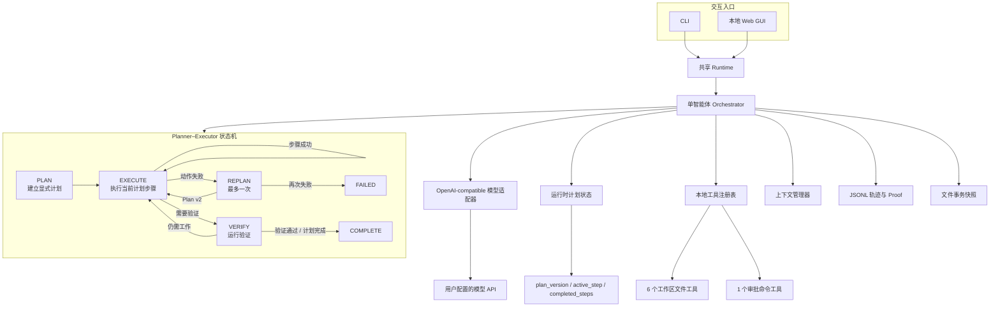
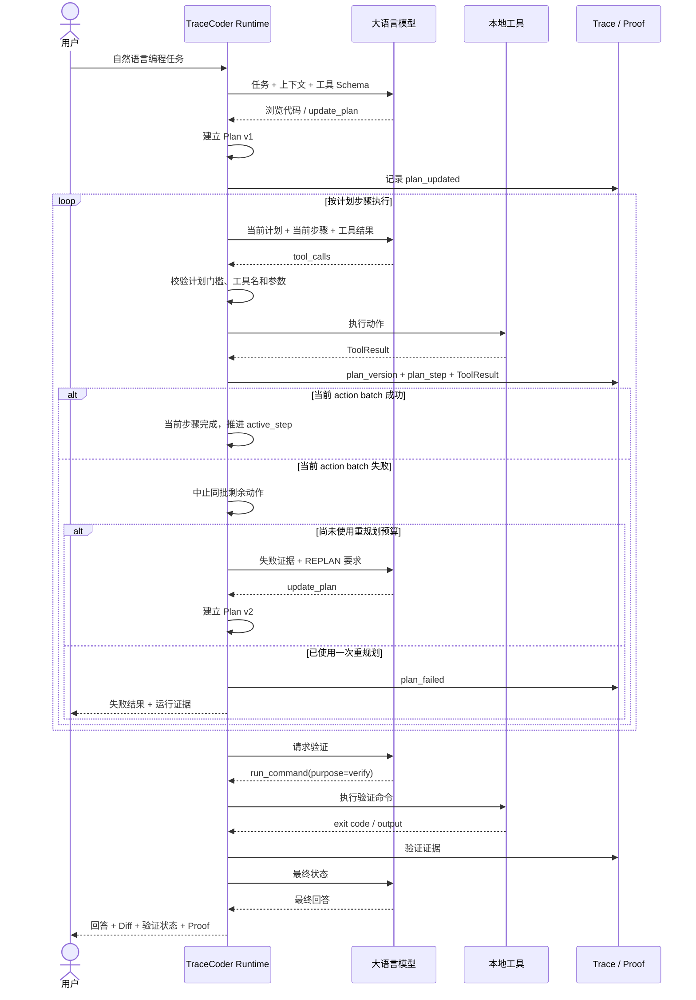

# TraceCoder

TraceCoder 是一个从零实现的本地编程智能体（coding agent）。它采用**单智能体 Planner–Executor 风格的有界编排架构**：模型在执行文件修改或命令之前必须先建立显式计划，运行时随后按照计划步骤执行本地工具；如果某一步执行失败，可在受限预算内进行一次重规划，修改完成后还必须通过独立的验证阶段，才能正常完成任务。

整体运行流程可以概括为：

```text
Plan -> Execute -> Replan? -> Verify -> Complete
                    |
                    +-------------> Failed
```

这里的 Planner、Executor 和 Verifier 是**同一个 Agent 在不同运行阶段承担的职责**。TraceCoder 没有引入运行时多 Agent、独立 Critic/Reflection Agent 或额外 Agent 框架。

项目直接使用模型原生 tool calling，自行维护消息历史、显式计划、阶段状态、上下文压缩、本地工具执行、验证证据、确定性终止和 JSONL 轨迹。

项目没有使用 LangChain、LlamaIndex、OpenAI Agents SDK等 Agent 框架，也不依赖 API 服务端托管的代码执行或文件工具。

* GitHub：https://github.com/fanyuezuishuai/CodingAgent
* Python：3.11+
* 模型接口：OpenAI-compatible Chat Completions tool calling
* 入口：CLI、本地 Web GUI、GitHub Codespaces

## 核心功能

| 功能                       | 实现                                                                          |
| ------------------------ | --------------------------------------------------------------------------- |
| 单智能体 Planner–Executor 编排 | 使用显式 `Plan -> Execute -> Replan -> Verify` 阶段控制，而不是无约束地连续调用工具               |
| 显式执行计划                   | 文件修改和命令执行前必须通过 `update_plan` 建立有序计划；运行时维护计划版本、当前步骤和完成状态                     |
| 有界重规划                    | action batch 失败后允许重新规划剩余工作一次；第二次计划执行失败直接以 `plan_failed` 终止                  |
| Fail-fast 批次执行           | 同一批动作中首个动作失败后，后续动作不再实际执行，避免基于错误前提继续修改                                       |
| 计划—执行关联                  | 工具请求、结果和轨迹记录携带 `plan_version` 与 `plan_step`，可以还原某次操作属于哪个计划步骤                |
| 独立验证阶段                   | `purpose=verify` 的命令进入 `VERIFY` 阶段；修改后的旧验证结果自动失效                            |
| 7 个本地执行工具                | 安全建目录、目录浏览、文本搜索、文件读取、文件写入、精确替换、命令执行                                         |
| 1 个编排控制工具                | `update_plan` 只管理运行时计划，不直接修改工作区                                             |
| 工具参数校验                   | 自行实现 JSON Schema 子集校验；未知工具和错误参数以结构化结果返回                                     |
| 工作区文件安全                  | 拒绝绝对路径、`..`、越界符号链接、Windows 路径别名/数据流，以及工作区根目录顶层的 `.env`、`.git`、`.tracecoder` |
| 命令审批                     | CLI/Web 均在执行前展示真实 argv 和 cwd；Web 同时显示中文用途说明                                 |
| 确定性终止                    | 支持正常完成、计划失败、用户停止、最大步数、重复调用和提供方错误                                            |
| 验证状态                     | 修改后要求执行验证命令；明确区分“模型选择的验证命令通过”和“完整正确性已经证明”                                   |
| 多轮上下文                    | 同一 Web 对话持续携带 user/assistant/tool 消息；只有“新对话”会重置                             |
| DeepSeek 思考模式            | 解析并原样回传可选 `reasoning_content`，支持跨工具步骤和跨用户轮次继续请求                             |
| 上下文压缩                    | 超预算时保留当前问题、运行时事实、计划状态、最近轮次和完整 tool-call/result 包                            |
| 可追踪运行                    | 每次运行写入按序、带时间、递归脱敏的 JSONL 事件轨迹                                               |
| Proof Mode               | 从真实 Diff、命令退出码、验证状态和终止原因生成 JSON/Markdown 证据，不采信模型自述                         |
| 事务式回滚                    | 修改前保存快照、运行结束封存最终状态；可接受或回滚文件工具改动                                             |
| 本地 Web GUI               | 历史对话与项目归组、Markdown 回答、折叠过程、文件上传、审批、停止和刷新恢复                                  |

## 架构



模型通过统一的 OpenAI-compatible 接口工作；状态机、计划版本、步骤推进、重规划预算和执行门槛由本地 Runtime 强制维护。

这种设计保留了单智能体实现较低的协议和调用开销，同时把原来隐式存在于模型推理中的“先想方案、再修改、失败后调整、最后验证”变成可观察、可约束、可追踪的运行时状态。

## 一次典型任务的运行过程



## 核心代码

| 文件                              | 职责                                                                                                            |
| ------------------------------- | ------------------------------------------------------------------------------------------------------------- |
| `src/tracecoder/domain.py`      | `ToolCall`、`ModelReply`、`ToolResult`、`RunResult`，以及 `AgentPhase`、`TerminationReason`、`VerificationStatus` 等状态 |
| `src/tracecoder/agent.py`       | 单智能体 Planner–Executor 状态机、显式计划、步骤推进、一次重规划、批次 fail-fast、重复检测、验证提醒、取消和确定性终止                                     |
| `src/tracecoder/context.py`     | 单轮/多轮消息与运行时事实的确定性预算压缩                                                                                         |
| `src/tracecoder/runtime.py`     | 为 CLI/Web 统一装配模型、工具、上下文、轨迹和事务                                                                                 |
| `src/tracecoder/config.py`      | `.env`、系统环境变量、默认值与配置校验                                                                                        |
| `src/tracecoder/identifiers.py` | 轨迹、Proof 与事务文件名使用的安全运行标识校验                                                                                    |
| `src/tracecoder/trace.py`       | 追加式 JSONL 轨迹、阶段变化、计划关联、顺序锁和递归凭据脱敏                                                                             |
| `src/tracecoder/evidence.py`    | 运行时 Proof 数据、Markdown/JSON 导出                                                                                 |
| `src/tracecoder/transaction.py` | 文件工具修改前快照、接受与安全回滚                                                                                             |
| `src/tracecoder/scenarios.py`   | 课程项目修复与小型项目生成任务预设                                                                                             |
| `src/tracecoder/llm/`           | Provider-neutral 模型协议和 OpenAI-compatible 适配器                                                                  |
| `src/tracecoder/tools/`         | 工具 Schema、参数验证、工作区文件操作和命令执行                                                                                   |
| `src/tracecoder/cli.py`         | `run`、`trace`、`transaction`、`web` 命令                                                                          |
| `src/tracecoder/web.py`         | FastAPI、后台运行、会话历史、上传、审批和取消                                                                                    |
| `src/tracecoder/web_static/`    | 原生 HTML/CSS/JS GUI 与安全 Markdown 渲染                                                                            |

## Agent 编排与运行证据

`Agent.run()` 不再只是一个无结构的“模型—工具循环”，而是在有界循环外维护显式 Planner–Executor 状态。

运行时维护：

```text
phase
plan_version
steps
active_step
completed_steps
replans_used
verification_status
changed_files
recent_failures
```

典型执行规则如下：

1. 初始进入 `PLAN` 阶段；
2. 模型可以先使用只读工具理解项目；
3. 在执行文件修改或 `run_command` 前，必须通过 `update_plan` 建立显式计划；
4. 计划创建后进入 `EXECUTE`；
5. 每批成功动作归属于当前 `plan_step`，成功后运行时自动推进下一步；
6. 如果一批动作中的某个动作失败，同批后续动作返回 `action_batch_aborted`，不再实际执行；
7. 第一次执行失败进入 `REPLAN`，模型可以替换剩余计划一次；
8. 新计划生成新的 `plan_version`；
9. 如果重规划后的执行再次失败，进入 `FAILED`，以 `plan_failed` 结束；
10. `run_command(purpose=verify)` 进入 `VERIFY` 阶段；
11. 工作区再次发生修改后，之前的验证结果失效；
12. 只有计划状态和验证要求均满足时，模型的无工具最终回复才能被视为正常完成。

计划控制和验证提醒是两套独立约束：建立了计划并不代表已经验证，通过验证也不代表尚未完成的计划可以被跳过。

终止原因包括：

* `completed`：计划和验证门槛满足后正常完成；
* `plan_failed`：计划未完成，或重规划后的执行再次失败；
* `interrupted`：用户停止或中断；
* `max_steps`：达到最大模型步数；
* `repeated_call`：连续重复相同工具和参数；
* `provider_error`：模型 API 或响应协议错误。

运行结束时，CLI/Web 展示的修改文件、统一 Diff、命令退出码、计划状态、验证状态和终止原因均来自本地运行时，而不是模型文字自述。

工具轨迹同时记录：

```text
phase
plan_version
plan_step
tool_call_id
tool
arguments
result
elapsed_seconds
```

因此可以从 JSONL 轨迹中追踪：

```text
用户目标
  -> Plan v1
  -> Step 1
  -> Tool Call
  -> Tool Result
  -> Step 2 failed
  -> Plan v2
  -> Verify
  -> Final Result
```
