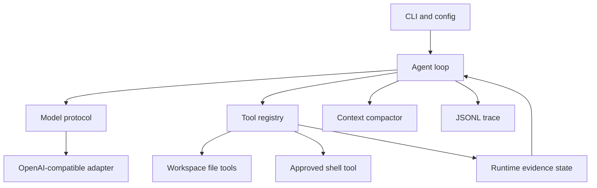
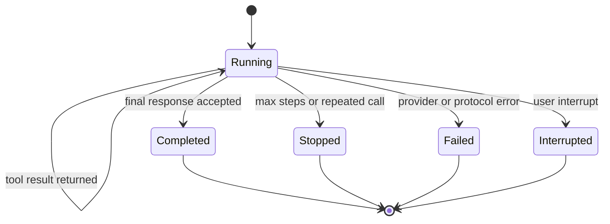

# TraceCoder Core - Plan

## Goal Capsule

- **Objective:** 让用户在本地代码仓库中用自然语言交付编程任务，并获得可检查、可回放的修改与验证证据。
- **Means:** 构建一个自行管理模型对话、本地工具、执行循环、上下文和终止条件的 Python CLI 编程智能体。
- **Product authority:** 本计划只负责可运行的单智能体 MVP；图形界面、多智能体和远程工具不属于当前范围。
- **Open blockers:** 无。

---

## Product Contract

### Summary

TraceCoder 将模型原生 tool calling 转换为受控的本地读写和命令执行循环，并在每次任务结束时提供修改、验证和退出原因。
首版强调代码结构清楚、行为可测试和执行轨迹透明。

### Problem Frame

题目要求重要的 Agent Harness 逻辑由参赛者自行实现，而不是包装现成 Agent 产品或框架。
因此项目价值不只在于模型能否生成代码，还在于仓库能否清晰展示工具定义与执行、历史管理、错误恢复和循环终止的完整实现。

### Key Decisions

- **采用可追踪、可验证的通用 CLI。** (session-settled: user-approved — chosen over a generic CLI or a bug-fix-only agent: it balances visible engineering depth with a feasible individual scope) Governs R1-R12.
- **首版保持单智能体和单模型适配器。** 减少非核心集成成本，Governs R2, R11.
- **所有文件和命令工具均在本地执行。** 不依赖 API 服务端托管的文件或代码执行能力，Governs R3-R7.

### Requirements

**Agent loop**

- R1. 用户可以从命令行指定工作目录和自然语言任务并启动一次运行。
- R2. 系统必须自行维护消息历史，解析模型文本与工具调用，并将工具结果送回模型继续推理。
- R3. 模型可调用目录浏览、文本搜索、文件读取、文件写入、局部替换和命令执行工具。
- R4. 工具参数必须在执行前验证，未知工具或无效参数以结构化错误返回模型。
- R5. 循环必须在模型完成、用户中断、达到最大步数或检测到重复调用时确定性终止。

**Safety and execution**

- R6. 所有文件路径必须解析到工作区内部，越界访问不得执行。
- R7. 命令执行必须具有超时、输出长度限制和可选的修改操作确认。
- R8. 文件修改后，智能体必须尝试执行验证命令，或在最终报告中明确说明未验证原因。

**Context and evidence**

- R9. 历史接近配置上限时，系统必须压缩较早的消息，同时保留任务、计划、修改和失败信息。
- R10. 每次运行必须记录模型响应、工具请求、工具结果、耗时和终止原因的 JSONL 事件轨迹。
- R11. 模型提供方必须通过环境变量配置，首版支持 OpenAI-compatible Chat Completions tool calling。
- R12. 项目必须能用假模型响应测试完整循环，自动化测试不依赖真实 API key。

### Actors

- A1. **用户：** 在本地仓库中提出任务、批准敏感操作并查看结果。
- A2. **语言模型：** 根据消息与工具定义提出下一步操作或最终回复。
- A3. **TraceCoder runtime：** 校验和执行工具、维护状态并决定是否继续循环。

### Key Flows

- F1. Complete a programming task
  - **Trigger:** A1 submits a task for a workspace.
  - **Actors:** A1, A2, A3.
  - **Steps:** A3 sends context and tool definitions to A2, executes validated calls, returns results, and repeats until completion.
  - **Outcome:** A1 receives the final summary, changed files, verification result and trace identifier.
  - **Covered by:** R1-R5, R8, R10.
- F2. Reject an unsafe tool call
  - **Trigger:** A2 requests a path outside the workspace or a disallowed operation.
  - **Actors:** A2, A3.
  - **Steps:** A3 rejects the request without executing it and appends the structured failure to history and trace.
  - **Outcome:** A2 can choose a safe alternative while the workspace boundary remains intact.
  - **Covered by:** R4, R6, R7, R10.
- F3. Stop a non-progressing run
  - **Trigger:** The run exceeds its step budget or repeats the same call.
  - **Actors:** A3.
  - **Steps:** A3 stops the loop and records the applicable termination reason.
  - **Outcome:** A1 receives a bounded failure report rather than a hanging process.
  - **Covered by:** R5, R10.

### Acceptance Examples

- AE1. End-to-end edit and test
  - **Covers R1-R5, R8, R10, R12.**
  - **Given:** A fake model requests a file read, a write and a test command.
  - **When:** The agent runs against a temporary project.
  - **Then:** The file changes, the test result returns to the model, and the trace ends with a completed event.
- AE2. Workspace escape
  - **Covers R4, R6, R10.**
  - **Given:** A model requests `../secret.txt`.
  - **When:** The file tool validates the path.
  - **Then:** No outside file is read and a structured boundary error is recorded.
- AE3. Command timeout
  - **Covers R7, R10.**
  - **Given:** A command exceeds the configured timeout.
  - **When:** The shell tool executes it.
  - **Then:** The process is stopped and the timeout result is returned without ending the agent process unexpectedly.
- AE4. Repeated call termination
  - **Covers R5, R10, R12.**
  - **Given:** A fake model repeatedly returns the same tool call.
  - **When:** The configured repetition threshold is reached.
  - **Then:** The run stops with a repetition termination reason.

### Success Criteria

- 两个示例任务能够端到端完成，其中至少一个包含失败测试修复。
- 核心循环、路径边界、命令超时、重复检测和假模型流程均有自动化测试。
- API key 仅从环境变量读取，仓库及示例配置不包含凭据。
- 评委可以通过一次运行的 JSONL 轨迹还原模型、工具和终止事件。

### Scope Boundaries

**Deferred for later**

- 会话恢复、流式输出和多个模型提供方。
- 更精细的命令风险分级和跨平台进程隔离。

**Outside this product's identity**

- Web GUI、IDE 插件、多智能体协作和插件市场。
- API 服务端托管的代码执行、文件工具或现成 Agent 框架。

### Dependencies and Assumptions

- Python 3.11 或更高版本可用。
- 运行真实任务时，用户提供支持 Chat Completions tool calling 的 OpenAI-compatible API。
- 用户对指定工作区内的代码拥有读写和命令执行权限。

---

## Planning Contract

Product Contract restructured, no scope change: the former Code Framework moved into the implementation-facing sections below.

### Key Technical Decisions

- KTD1. **Keep the core loop provider-neutral.** The agent depends on a small model protocol and converts SDK responses at the adapter boundary. Governs R2, R11, R12.
- KTD2. **Use one tool registry and one result contract.** Each tool exposes its JSON Schema, validator and executor through the registry, and returns `ok`, `data`, `error_code`, `message` and `metadata`. Governs R3, R4.
- KTD3. **Resolve native file paths through one workspace policy.** Relative paths, existing symlinks and write parents must resolve inside the canonical workspace, and `.tracecoder/` is reserved for runtime evidence. Governs R6.
- KTD4. **Treat shell approval as a human trust boundary.** The CLI approves the exact argument vector and workspace before `shell=False` execution, and an explicit auto-approve flag grants the command the user's host permissions. Governs R7.
- KTD5. **Compress context deterministically.** Keep the task, runtime fact summary and recent complete assistant/tool bundles without adding another model call. Governs R9.
- KTD6. **Generate completion evidence from runtime state.** Changed files, verification status and termination reason come from successful tool results and loop state, not model claims. Governs R5, R8, R10.
- KTD7. **Write append-only JSONL traces.** Every event has a session identifier, sequence, timestamp and event type, and configured secrets are redacted before persistence. Governs R10.

### High-Level Technical Design





### Assumptions

- The first release uses synchronous model and tool execution because concurrency does not improve the required demonstration.
- A successful command marked with verification purpose after the latest file mutation counts as verified evidence.
- A final response after an unverified mutation receives one runtime reminder; a second final response is accepted and reported as unverified.
- Trace files live under `.tracecoder/traces/` and are ignored by Git.

### Risks and Dependencies

- Approved commands can access resources outside the workspace and may leave descendant processes after a timeout; use exact `argv` approval, remove provider credentials from the child environment and document the residual host risk.
- Provider response shapes vary despite OpenAI compatibility; reject malformed responses at the adapter boundary without crashing the core loop.
- Source text and command output are sent to the configured model provider; show the base URL and model before a run without displaying credentials.
- Context compaction can produce invalid provider history; retain assistant tool-call messages together with their tool results.

---

## Output Structure

```text
pyproject.toml
.gitignore
README.md
src/tracecoder/
  __init__.py
  __main__.py
  agent.py
  cli.py
  config.py
  context.py
  domain.py
  trace.py
  llm/
    __init__.py
    base.py
    openai_compatible.py
  tools/
    __init__.py
    filesystem.py
    registry.py
    shell.py
tests/
  fakes.py
  test_agent_loop.py
  test_config.py
  test_context.py
  test_filesystem_tools.py
  test_shell_tool.py
  test_trace.py
```

---

## Implementation Units

### U1. Project foundation and domain contracts

- **Goal:** Create the installable package, environment configuration and provider-neutral domain types.
- **Requirements:** R1, R4, R11, R12.
- **Dependencies:** None.
- **Files:** `pyproject.toml`, `.gitignore`, `src/tracecoder/__init__.py`, `src/tracecoder/config.py`, `src/tracecoder/domain.py`, `src/tracecoder/llm/base.py`, `tests/test_config.py`, `tests/fakes.py`.
- **Approach:** Define typed model replies, tool calls, tool results, run results, verification states and termination reasons before integrating side effects.
- **Test scenarios:** Missing credentials fail clearly; configured model and base URL load from environment; fake model responses use the same protocol as the real adapter.
- **Verification:** The package imports without the OpenAI SDK leaking into core domain types.

### U2. Workspace-safe local tools

- **Goal:** Implement the six primitive tools and their deterministic safety and error contracts.
- **Requirements:** R3, R4, R6, R7; F2; AE2, AE3.
- **Dependencies:** U1.
- **Files:** `src/tracecoder/tools/__init__.py`, `src/tracecoder/tools/registry.py`, `src/tracecoder/tools/filesystem.py`, `src/tracecoder/tools/shell.py`, `tests/test_filesystem_tools.py`, `tests/test_shell_tool.py`.
- **Approach:** Centralize schema validation and canonical path resolution, reserve `.tracecoder/`, inject command approval and execute argument vectors with the workspace as `cwd`.
- **Test scenarios:** Covers AE2. Reject `..`, absolute, symlink and reserved-directory access; reject ambiguous replacement without modifying the file; reject unknown tools and malformed arguments; Covers AE3. return timeout and truncated-output metadata; denied commands never start; child processes cannot read the configured provider key.
- **Verification:** Every tool returns a serializable structured result and no file tool can cross the workspace boundary.

### U3. Provider, context and trace infrastructure

- **Goal:** Add the OpenAI-compatible adapter, deterministic compaction and append-only traces.
- **Requirements:** R2, R9-R12.
- **Dependencies:** U1, U2.
- **Files:** `src/tracecoder/llm/openai_compatible.py`, `src/tracecoder/context.py`, `src/tracecoder/trace.py`, `tests/test_context.py`, `tests/test_trace.py`.
- **Approach:** Convert SDK responses at one boundary, keep complete tool-call bundles during compaction and redact configured secrets from JSONL events.
- **Test scenarios:** Multiple tool calls preserve their identifiers and order; large history compacts while retaining task and runtime facts; every trace line parses as JSON; configured secrets are redacted; corrupt trace input fails clearly.
- **Verification:** Core tests run without network access, and real-provider setup is isolated to one adapter.

### U4. Agent loop and runtime evidence

- **Goal:** Implement the bounded autonomous loop and runtime-derived completion report.
- **Requirements:** R2, R4, R5, R8-R10, R12; F1-F3; AE1, AE4.
- **Dependencies:** U1-U3.
- **Files:** `src/tracecoder/agent.py`, `tests/test_agent_loop.py`.
- **Approach:** Execute model turns and tool calls sequentially, track mutations and verification, detect consecutive repeated calls, and close every terminal path with one trace event.
- **Execution note:** Start with fake-model integration scenarios before connecting the live adapter.
- **Test scenarios:** Covers AE1. read, write and verify in one run; Covers AE4. stop on repeated calls; stop on maximum turns; recover from invalid tool requests; keep multiple tool results paired to call IDs; report model claims without verification as unverified; invalidate prior verification after a later mutation; record provider errors and interrupts.
- **Verification:** A fake model can drive an end-to-end edit, verification and final report without an API key.

### U5. CLI and operator documentation

- **Goal:** Expose run and trace commands with clear preflight, approvals, exit codes and setup instructions.
- **Requirements:** R1, R7, R10, R11.
- **Dependencies:** U1-U4.
- **Files:** `src/tracecoder/__main__.py`, `src/tracecoder/cli.py`, `README.md`.
- **Approach:** Use the standard library CLI, validate workspace and configuration before starting, and display runtime evidence separately from model text.
- **Test scenarios:** Empty tasks and invalid workspaces fail before model calls; command approval accepts and rejects deterministically; success, incomplete failure and interrupt use distinct exit codes; trace viewing handles missing or corrupt files.
- **Verification:** A user can inspect help, run a task with environment configuration and read the resulting trace.

---

## Verification Contract

| Check | Scope | Done signal |
|---|---|---|
| `python -m pytest -q` | U1-U5 | All unit and fake-model integration tests pass. |
| `python -m tracecoder --help` | U5 | The CLI lists run and trace commands without requiring credentials. |
| `python -m tracecoder run --help` | U5 | Workspace, approval, budget and provider options are documented. |
| Fake-model end-to-end scenario | U2-U4 | A temporary file changes, verification passes and the final trace closes once. |
| Live-provider smoke task | U3-U5 | With user-provided credentials, the model reads a sample file and returns a bounded report. |

---

## Definition of Done

- U1-U5 are implemented with their named test scenarios.
- R1-R12 and AE1-AE4 are covered by code or automated verification.
- The full offline test suite passes without API credentials.
- The CLI help and fake-model end-to-end path work on Python 3.11.
- No credential value is committed or written to traces.
- Abandoned experiments and unused dependencies are absent from the final change set.
